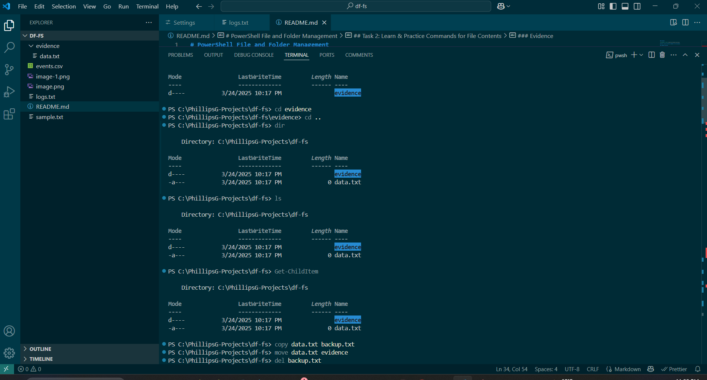
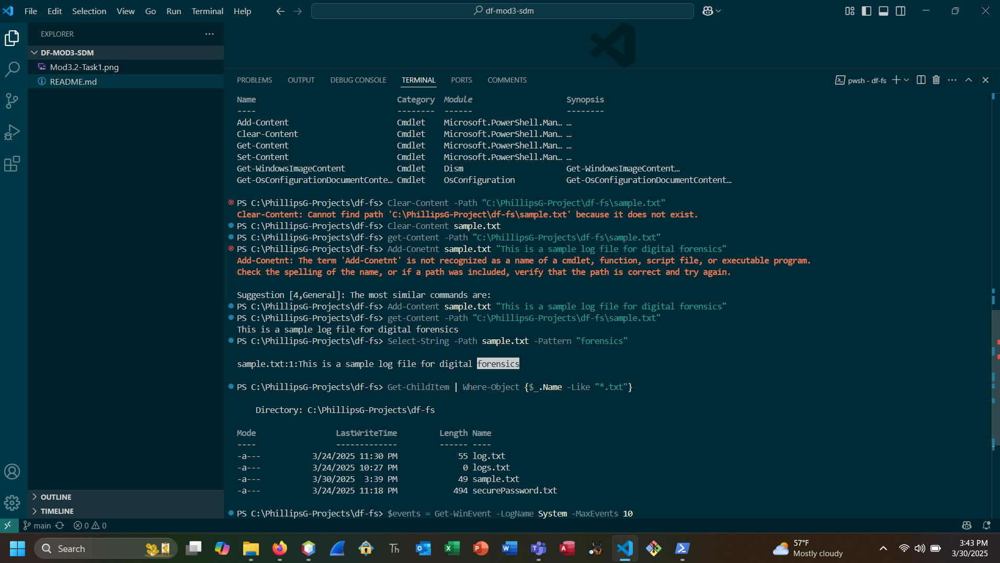
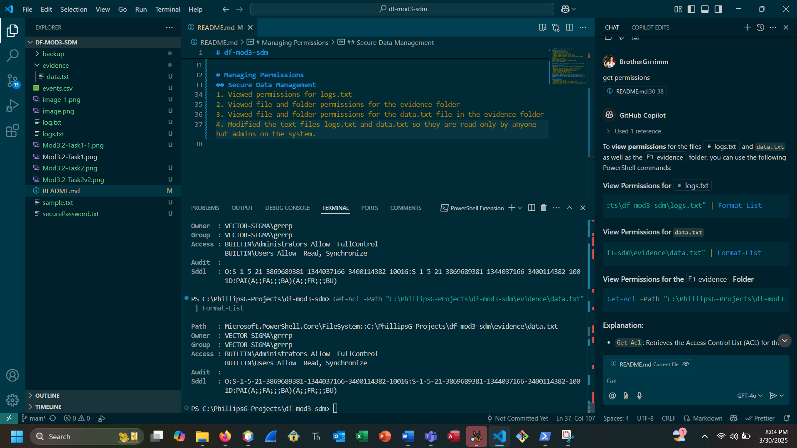

# df-mod3-sdm
a repository for Digital Forensics Project3: SDM

## SDM
### Commands for Files and Folders
1. Created a new file named "data.txt"
2. Created a new folder named "evidence"
3. Changed the current directory to "evidence"
4. Moved back to the parent directory
5. Listed the contents of the current directory usng dir
6. Listed the contents of the current directory using ls
7. Listed the contents of the current directory including hidden files and directories
8. Copied data.txt to backup.txt
9. Moved data.txt to evidence folder
10. Deleted backup.txt
11. Took a screen shoot of results of using these commands.

These commands are the very basis of criting folders, files, and manipulating them. You will uses these commands often.

### Commands for File Contents
1. Retrieved all events from the Windows event log and saved to a file named "logs.txt"
2. Verified the creation of the logs.txt file and accessed its contents
3. Created a new text file named "sample.txt" and added sample content
4. Retrieved the contents of the sample.txt file
5. Searched for the specific text "forensics" within sample.txt
6. Filtered items using Where-Object "*.txt"
7. Exported data to a CSV file named "events.csv"

These commands are helpful for pulling event longs and redirecting them to a file. They help you by allowing you to filter for specifc words or phrases helping you narrow down your searches instead of spending hours combing line by line.

## Manage Permissions
1. Viewed permissions for logs.txt
2. Viewed file and folder permissions for the evidence folder
3. Viewed file and folder permissions for the data.txt file in the evidence folder
4. Modified the text files logs.txt and data.txt so they are read only by anyone but admins on the system.

These commands are valuable to keep unapproved users from inadvertently altering your data.

## PowerShell Scripting
# Create a script to automate logging by date.
# I queried co-pilot and asked for the steps. 
1. I defined the folder where the log file would be sved.
2. I ensured that the folder existed and if not that it was created.
3. I generated the log file name with the current date
4. I defined the full path for the log file.
5. I retrieved events from the Windows Event log
6. I saved the log content to the file
7. I outputted the log file path

I followed the instructions provided by co-pilot but still had errors in my code that kept the script from running. 
1. The first error was I mistyped the Path name in the If statement. I checked the code and realized my mistake. Simplke fix.
2. The second mistake was in the code of the step retrieving the logs from the Windpws Event Log. I used "newest" instead of "MaxEvents". Again another simple fix.
3. After fixing all my errors the script ran like it was intended, saving the log with the current date.

PowerShell scripting is immensely useful because it allows you to automate mundane tasks so you can focus more on examining the date and less on things like saving log files.